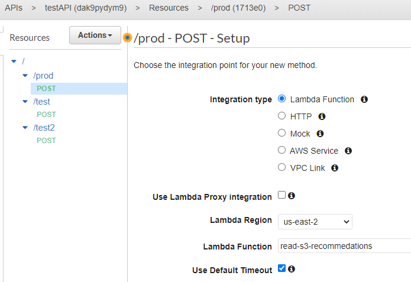

Here I will show an example of training a Recommender system and how to use it through the REST API with AWS Lambda and API Gateway    

* [first, we will build the model in Jupyter notebook](#sec1) 
* [then we will upload recommendations to the AWS S3](#sec2)
* [after this we will create Lambda function to take our recommendations from AWS S3 during request](#sec3)
* [finally, we will describe an API for our pipeline in API Gateway that will accept requests and provide the correct responses](#sec4)

API pipeline scheme

<a name="sec1"/>

### first, we will build the model on "reviews_Alternative_Rock" dataset in Jupyter notebook

["AWS_Lambda_Recommendations.ipynb"](/notebooks/AWS_Lambda_Recommendations.ipynb)

<a name="sec2"/>

### then we will upload recommendations to the AWS S3

* to upload the final recommendations, I create a bucket "lambda-recommendations-test" on AWS S3 

* Let's write one file and check the result

* Let's check how the algorithm works on all elements

<a name="sec3"/>

### after this we will create Lambda function to take our recommendations from AWS S3 during request

* Let's create a lambda-function "read-s3-recommendations"

* Write the function code and deploy

<xml/>

    import json, pickle, boto3
    s3_client = boto3.client('s3')
    lambda_client = boto3.client('lambda')
    bucket_name = 'lambda-recommendations-test'
    def lambda_handler(event, context):
        if event['mode']=='recomm':
            input_art = event['data_array'][0]['product']
            out_ = pickle.loads(s3_client.get_object(Bucket=bucket_name,Key=input_art+'_v1')['Body'].read())
            return json.loads(json.dumps(out_))
        else:
            return {
                "errorDetails": "Only method='recomm' is allowed",
                "statusCode": 500,
                "message": "An error occured on the server side"
            }    

* let's test our function

* We will improve the function so that it can issue a certain number of recommendations

* test

<a name="sec4"/>

### finally, we will describe an API for our pipeline in API Gateway that will accept requests and provide the correct responses    

* Create a new API in Amazon API Gateway

* Specify parameters

* Let's create an endpoint "prod" by specifying a lambda function

* Let's create "ReqLambda" - a model for requests

<xml/>
    
    {
    "$schema": "http://json-schema.org/draft-06/schema#",
    "title": "ReqLambda",
    "type": "object",
    "properties": {
        "mode": {
            "description": "Specify the procesing mode. The only mode allowed: 'product' ",
            "type": "string"},
        "limit":{
            "description": "The number of recommendations",
            "type": "number"
                },
        "data_array":{
            "type":"array",
            "items": {
                "$ref": "#/definitions/Data"
            }
        }
    },
    "definitions": {
        "Data": {
            "type": "object",
            "properties": {
                "product": {
                    "description": "Product ID",
                    "type": "string"}
            }
        }
    },
    "required": ["mode", "limit", "data_array"]
    }

* And also we need to create a model for responses "RespLambda"

<xml/>

    {
    "$schema": "http://json-schema.org/draft-07/schema#",
    "title": "RespLambda",
    "type": "object",
    "properties": {
        "data": {
            "type": "array",
            "items": {
                "type": "object",
                "properties": {
                    "similar_elements": {
                        "type": "array",
                        "items": {
                            "type": "number"
                        }
                    },
                    "sku_rating": {
                        "type": "array",
                        "items": {
                            "type": "number"
                        }
                    },
                    "last_reviewed": {
                        "type": "array",
                        "items": {
                            "type": "string"
                        }
                    }
                }
            }
        }
    }
    }

 
* Next, we need to select our "ReqLambda" request model in the Request method.

* And specify our "RespLambda" response model in the Method Response

* Test results match the results of the previous test after creating the Lambda function

* Let's deploy our method to stage "prod"

* Then we create an API key for our method

* Also we create a usage plan for the method

* Let's associate the plan with our method (more precisely, with the stage in which the method is located)

* And also bind to the API key

* Let's see the result of creating a usge plan for our prod method

* Copy the URL to our method

* Let's check the efficiency of the method from the outside by sending a test request via POSTMAN - the result corresponds to the previous tests, the status is 200, the response speed is excellent

* and a few more requests

author: Vadim Danilchenko

email: vndanilchenko@gmail.com 

