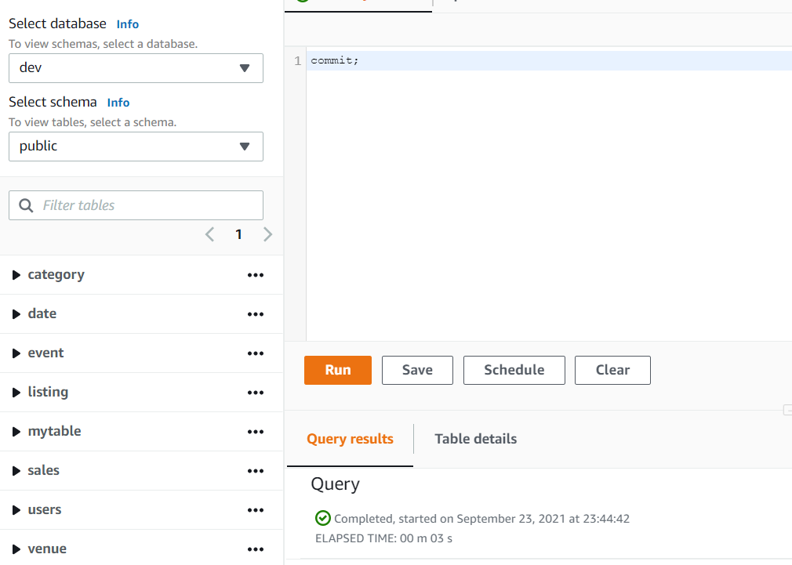
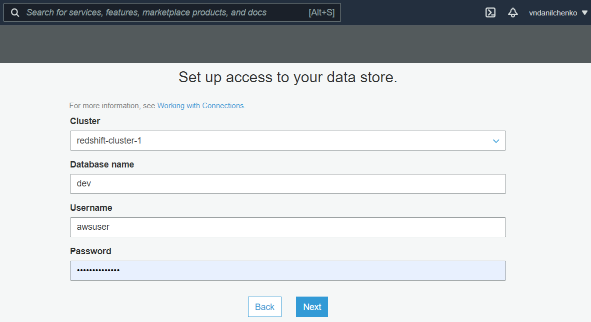
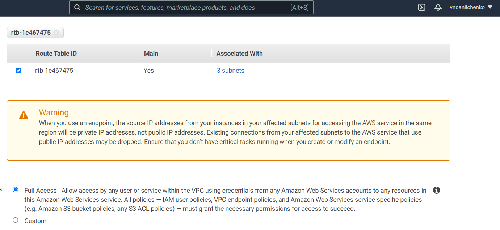
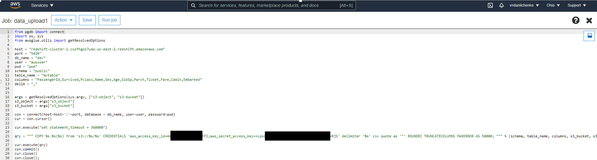
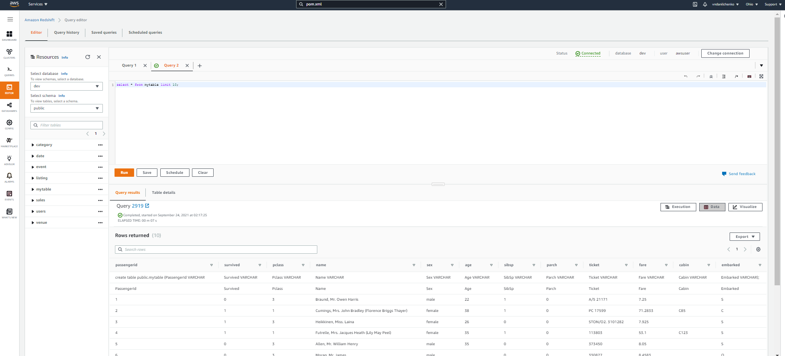

# ПРИМЕР НАСТРОЙКИ ETL МЕЖДУ AWS S3 И AWS REDSHIFT

в качестве примера создадим кластер Redshift, добавим в него таблицу, в которую в последствии с помощью процедуры ETL-инструмента AWS Glue запишшем данные из файла titanic.csv, размещенного на AWS S3  

##### Этапы 
* [создание кластера](#sec1)  
* [тестовый запрос](#sec2)  
* [создаем таблицу](#sec3)  
* [создаем подключение Glue](#sec4)  
* [создаем роль для Glue и S3](#sec5)   
* [создаем эндпоинт](#sec6)  
* [тестируем соединение Glue](#sec7)  
* [добавляем роль кластеру](#sec8) 
* [добавляем файл в S3](#sec9) 
* [создаем job](#sec10) 
* [пишем скрипт для выполнения джоба](#sec11) 
* [указываем параметры джоба](#sec12) 
* [запускаем джоб](#sec13) 
* [проверяем результаты](#sec14) 

<a name="sec1"/>

## создадим кластер


<a name="sec2"/>

### выполним тестовый запрос к таблице pg_am


<a name="sec3"/>

### создадим таблицу mytable с полями из датасета titanic.csv

```
create table public.mytable (PassengerId VARCHAR, 
                             Survived VARCHAR, 
                             Pclass VARCHAR, 
                             Name VARCHAR, 
                             Sex VARCHAR, 
                             Age VARCHAR, 
                             SibSp VARCHAR, 
                             Parch VARCHAR, 
                             Ticket VARCHAR, 
                             Fare VARCHAR, 
                             Cabin VARCHAR, 
                             Embarked VARCHAR);

commit;
```




<a name="sec4"/>

### создадим подключение Glue




<a name="sec5"/>

###	создадим роль для Glue и S3


<a name="sec6"/>

###	создадим эндпоинт





<a name="sec7"/>

###	тестируем соединение Glue


<a name="sec8"/>

###	добавим роль кластеру


<a name="sec9"/>

###	добавим датасет в S3


<a name="sec10"/>

###	создадим job


<a name="sec11"/>

###	напишем скрипт для выполнения джоба

```
from pgdb import connect
import os, sys
from awsglue.utils import getResolvedOptions

host = "redshift-cluster-1.cssfhgos7uao.us-east-2.redshift.amazonaws.com"
port = "5439"
db_name = "dev"
user = "awsuser"
pwd = "pwd"
schema = "public"
table_name = "mytable"
columns = "PassengerId,Survived,Pclass,Name,Sex,Age,SibSp,Parch,Ticket,Fare,Cabin,Embarked"
delim = ","


args = getResolvedOptions(sys.argv, ["s3-object", "s3-bucket"])
s3_object = args["s3_object"]
s3_bucket = args["s3_bucket"]

con = connect(host=host+':'+port, database = db_name, user=user, password=pwd)
cur = con.cursor()

cur.execute("set statement_timeout = 360000")

qry = """ COPY %s.%s(%s) from 's3://%s/%s' CREDENTIALS 'aws_access_key_id=access_key;aws_secret_access_key=secret' delimiter '%s' csv quote as '"' ROUNDEC TRUNCATECOLUMNS MAXERROR AS 50000; """ % (schema, table_name, columns, s3_bucket, s3_object, delim)

cur.execute(qry)
con.commit()
cur.close()
con.close();
```




<a name="sec12"/>

###	укажем параметры джоба


<a name="sec13"/>

###	запускаем джоб


<a name="sec14"/>

###	проверяем результат на кластере redshift, послав несколько sql-запросов





author: Vadim Danilchenko

email: vndanilchenko@gmail.com 